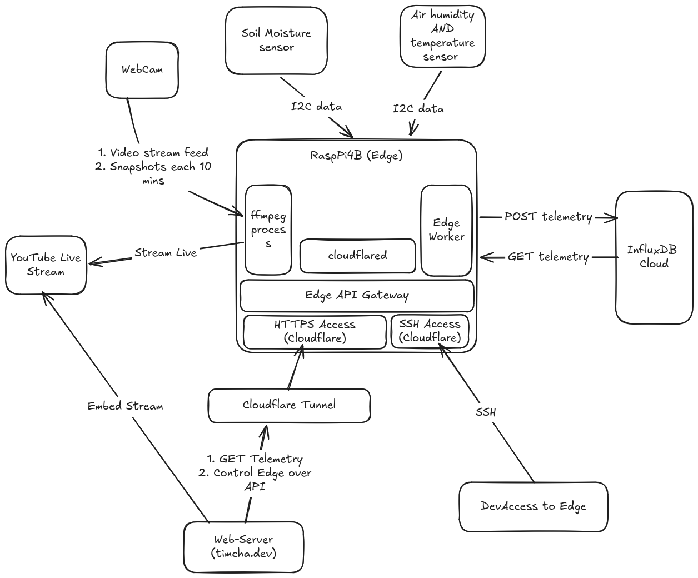

# fig-ure

Edge-native IoT monitoring and management system built for a Raspberry Pi 4B. Tracks environmental telemetry for a fig tree, streams live video, and exposes a secure control API without opening any public router ports.

## Architecture



- **Edge Node:** Raspberry Pi 4B running Raspberry Pi OS Lite (Debian).
- **Sensors:** I2C sensor pipeline (BME280 reading temp/humidity/pressure, plus soil moisture sensors).
- **Video Pipeline:** `ffmpeg` process manager for local snapshots, webcam ingestion, and live YouTube streaming.
- **Telemetry:** Asynchronous worker pushing metrics to InfluxDB Cloud with local disk fallback for offline resilience.
- **Networking:** Cloudflare Tunnel (`cloudflared`) exposing secure HTTPS APIs and SSH access without port forwarding.

## Core Modules

- `fig-ure.sensors`: Asynchronous I2C sensor reader (`core.async`).
- `fig-ure.telemetry`: Background metrics worker (InfluxDB push & local buffer).
- `fig-ure.stream`: Process lifecycle manager for `ffmpeg` pipeline.
- `fig-ure.api`: Edge API gateway exposed via Cloudflare Tunnel.

## Tech Stack

- **Language:** Clojure (JDK 21)
- **Task Runner:** Babashka (`bb`)
- **Environment Management:** Nix Flakes (`flake.nix`) & `direnv` (`.envrc`)
- **Async & Concurrency:** `clojure.core.async`
- **Lifecycle:** Integrant
- **Hardware:** Raspberry Pi 4B
- **Database:** InfluxDB Cloud
- **Tunnel:** Cloudflare Tunnels
- **Video:** `ffmpeg`

## Environment Setup

### 1. Nix & direnv (Recommended)

The development environment is fully managed via Nix Flakes.

- With `direnv` installed:
  ```bash
  direnv allow
  ```
- Or enter the shell manually:
  ```bash
  nix develop
  ```

This automatically provides JDK 21, Clojure CLI, Babashka, `ffmpeg`, `cloudflared`, and `i2c-tools`.

### 2. Raspberry Pi Node Provisioning

To bootstrap a fresh Raspberry Pi 4B running Raspberry Pi OS Lite, run the setup script:

```bash
chmod +x scripts/setup-pi.sh && ./scripts/setup-pi.sh
```

### 3. Environment Variables

Copy the template and fill in your secrets (InfluxDB token, YouTube stream key, device path):

```bash
cp .env.example .env
```

## Workflow & REPL-Driven Development (RDD)

The project relies heavily on **REPL-Driven Development (RDD)** and uses Babashka (`bb.edn`) for task automation.

### Available Tasks

- `bb dev`: Start the Clojure nREPL server (`0.0.0.0:7888`).
- `bb test`: Run Kaocha test suite.
- `bb lint`: Static analysis via `clj-kondo`.
- `bb fmt`: Check code formatting via `cljfmt`.
- `bb fmt-fix`: Auto-fix code formatting.
- `bb outdated`: Check for outdated dependencies (`antq`).
- `bb ci`: Run full CI pipeline (lint, fmt, and tests).

### REPL Workflow

1. Start nREPL via `bb dev`.
2. Connect your editor (CIDER / Calva / Cursive) to port `7888`.
3. In `dev/user.clj`, control the live system lifecycle:
   - `(go)`: Start component graph.
   - `(reset)`: Reload modified code and restart system graph cleanly.
   - `(halt)`: Stop running components.

## License

Copyright (c) 2026 Alexandr Timchenko

Distributed under the MIT License. See [LICENSE](file:///home/dirge/Development/fig-ure/LICENSE) for details.
